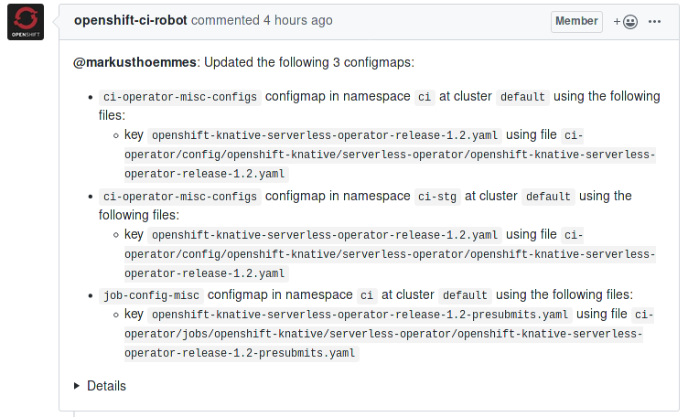

# Things

A personal index of things.

# Table of Contents

1. [OpenShift CI](#openshift-ci)
    1. [Clusters](#clusters)
        1. [api.ci](#apici)
        2. [app.ci](#appci)
        3. [build01](#build01)
        4. [build02](#build02)
        5. [vsphere](#vsphere)
    2. [Infrastructure Jobs](#infrastructure-jobs)
        1. [branch-ci-openshift-release-master-build01-apply](#branch-ci-openshift-release-master-build01-apply)
        2. [ci/prow/correctly-sharded-config](#ciprowcorrectly-sharded-config)

# OpenShift CI

OpenShift CI is a distributed CI system supporting the development of OpenShift
and other projects related to it. OpenShift CI's main building block is a
[Prow](#prow) instance running on the [app.ci](#appci) cluster, and
[ci-operator](#ci-operator), which is the tool run inside individual CI jobs
that builds OpenShift artifacts and orchestrates test workloads. Test workloads
are scheduled on build clusters (currently there are two, [api.ci](#apici) and
[build01](#build01)). OpenShift CI also relies on the central image repository
 on [api.ci](#apici) cluster.

Most configuration for OpenShift CI lives in
[openshift/release](#openshiftrelease) repository. Code for
[ci-operator](#ci-operator) and all other CI-related tools lives in
[openshift/ci-tools](#openshiftci-tools) repository. The team responsible for
running and developing OpenShift CI is [DPTP](#openshiftci-tools).

**LINKS**
- [Front-end to OpenShift Prow instance](https://prow.ci.openshift.org/)
- [An overview of ci-operator](https://prow.ci.openshift.org/)

## Clusters

### api.ci

`api.ci` is an OpenShift 3.11 cluster that serves two main purposes. First, it
serves as a build cluster for [Prow](#prow) jobs. Second, it is a main source of
truth for image content: it carries all
[Integration `ImageStream`s](#integration-imagestreams). The cluster is deployed
in GCP and has autoscaling enabled. The access to the cluster is provided to all
members of the `openshift` group on GitHub. All config for services running on
`api.ci` should be checked in the [openshift/release](#openshiftrelease)
repository.

**LINKS**

- [`api.ci` console](https://api.ci.openshift.org)
- [openshift/release directory holding config for services on api.ci](https://github.com/openshift/release/tree/master/core-services)

**SEE ALSO**

- [app.ci](#appci)
- [build01](#build01)
- [build02](#build02)
- [vsphere](#vsphere)

---

### app.ci

`app.ci` is an OpenShift 4 cluster run in
[OpenShift Dedicated](https://www.openshift.com/products/dedicated/). It mainly
serves as a cluster running the [Prow](#prow) control plane, as well as some other
important CI services (but not Prow jobs except for several exceptions tied to
the CI infrastructure itself). The cluster is deployed in AWS. All config for
services running on `app.ci` should be checked in the [openshift/release](#openshiftrelease)
repository.

**LINKS**

- [app.ci console](https://console-openshift-console.apps.ci.l2s4.p1.openshiftapps.com/dashboards)
- [openshift/release directory holding config for services on app.ci](https://github.com/openshift/release/tree/master/clusters/app.ci)

**SEE ALSO**

- [api.ci](#apici)
- [build01](#build01)
- [build02](#build02)

---

### build01

`build01` is an OpenShift 4 cluster that serves mainly as a build cluster for
[Prow](#prow) jobs. The cluster is deployed in AWS. The access to the cluster is
provided to all members of the `openshift` group on GitHub. All config for
services running on `build01` should be checked in the
[openshift/release](#openshiftrelease) repository, from where it is applied to
the cluster by the [applyconfig](#applyconfig) tool.

**LINKS**

- [build01 console](https://console.build01.ci.openshift.org/dashboards)
- [openshift/release directory holding config for services on build01](https://github.com/openshift/release/tree/master/clusters/build-clusters/01_cluster)

**SEE ALSO**

- [pull-ci-openshift-release-master-build01-dry](#pull-ci-openshift-release-master-build01-dry)
- [periodic-openshift-release-master-build01-apply](#periodic-openshift-release-master-build01-apply)
- [branch-ci-openshift-release-master-build01-apply](#branch-ci-openshift-release-master-build01-apply)
- [api.ci](#apici)
- [app.ci](#appci)
- [build02](#build02)
- [vsphere](#vsphere)

---

### build02

`build02` is an OpenShift 4 cluster that serves mainly as a build cluster for
[Prow](#prow) jobs. The cluster is deployed in GCP. The access to the cluster is
provided to all members of the `openshift` group on GitHub. All config for
services running on `build02` should be checked in the
[openshift/release](#openshiftrelease) repository, from where it is applied to
the cluster by the [applyconfig](#applyconfig) tool.

**LINKS**

- [build02 console](https://console.build02.ci.openshift.org/dashboards)
- [openshift/release directory holding config for services on build02](https://github.com/openshift/release/tree/master/clusters/build-clusters/02_cluster)

**SEE ALSO**

- [api.ci](#apici)
- [app.ci](#appci)
- [build01](#build01)
- [vsphere](#vsphere)

---

### vsphere

---

## Infrastructure Jobs

### branch-ci-openshift-release-master-build01-apply

---

### ci/prow/correctly-sharded-config

---

### openshift-release-master-config-bootstrapper

---

### periodic-openshift-release-master-build01-apply

---

### pull-ci-openshift-release-master-build01-dry

---

### openshift/ci-tools

### DPTP

### Integration Imagestreams

### openshift/release

[openshift/release](https://github.com/openshift/release) is the GitHub
repository that holds various configuration needed to build, test and release
OpenShift. The repository is owned by [DPTP](#dptp). The configuration can be
divided in these major areas:

- [`core-services/prow`](https://github.com/openshift/release/tree/master/core-services/prow): Configuration for OpenShift CI instance of [Prow](#prow)
- [`ci-operator/{config,jobs,step-registry}`](https://github.com/openshift/release/tree/master/ci-operator): [Prow job configuration](#prow-job-configuration), [ci-operator](#ci-operator)
 [configuration](#co-operator-configuration) and [shared step registry](#shared-step-registry) for
  OpenShift components
- [`core-services`](https://github.com/openshift/release/tree/master/core-services): Various configuration for important services running on [api.ci](#apici)
- [`services`](https://github.com/openshift/release/tree/master/services): Various configuration for other services running on [api.ci](#apici)
- [`clusters`](https://github.com/openshift/release/tree/master/clusters): Various configuration for services running on our other clusters, [build01](#build01) and
 [app.ci](#appci)

Most of the configuration in openshift/release is automatically applied after
merge to [api.ci](#apici) cluster by either the [applyconfig](#applyconfig) tool
or the [config-updater](#config-updater) [Prow plugin](#prow-plugins).

**LINKS**

- [openshift/release](https://github.com/openshift/release/)

**SEE ALSO**

- [ci/prow/correctly-sharded-config](#ciprowcorrectly-sharded-config)

### Shared step registry

## Software

### applyconfig

### ci-operator

### co-operator configuration

### config-bootstrapper

### config-updater

A [Prow](#prow) [plugin](#prow-plugins) that updates ConfigMaps in clusters when
files change in a Git repository. OpenShift CI uses it to deploy
configuration changes to production after they are merged to [openshift/release](#openshiftrelease).
It is configured by glob patterns that specify which files are supposed to be
updated in which ConfigMaps. It is triggered by a merge to a Git repository.
After it updates ConfigMaps, it posts a comment to the Pull Request whose merge
triggered it.

An example bot comment informing that ConfigMaps were updated after a merge.

**NOTES**

1. A common pitfall while configuring config-updater is that its configuration
   cannot be changed in a same PR as the content it is supposed to cover. For
   example, when adding new configuration file that is not yet covered by any
   glob pattern, the change to add a glob pattern to config-updater configuration
   must be done first in a separate pull request, otherwise the new files will
   not be deployed to the cluster. The reason for this that each pull request is
   processed by config-updater running with *existing* configuration, not the
   one changed in the pull request.
2. Changes to config-updater configuration in [openshift/release](#openshiftrelease)
   repository are tested by [ci/prow/correctly-sharded-config](#ciprowcorrectly-sharded-config)
   job.

**LINKS**

[README](https://github.com/kubernetes/test-infra/blob/master/prow/plugins/updateconfig/README.md) | [code](https://github.com/kubernetes/test-infra/tree/master/prow/plugins/updateconfig) | [OpenShift CI Configuration](https://github.com/openshift/release/blob/4aa6efe87ae360f63c5f724cb47433da2d979da8/core-services/prow/02_config/_plugins.yaml#L170)

**SEE ALSO**

- [config-bootstrapper](#config-bootstrapper)
- [openshift-release-master-config-bootstrapper](#openshift-release-master-config-bootstrapper)

### Deck

### Hook

### Prow

Prow is a Kubernetes-based CI/CD system. It is used both in Kubernetes upstream
community and in OpenShift. Its main purpose is to execute containerized testing
workloads and to automate and enforce various tasks and development workflow
steps, primarily in GitHub. Prow consists of several small microservices running
on a Kubernetes cluster. The OpenShift CI instance runs on the
[app.ci](#appci) cluster and is operated by [DPTP](#dptp).

**LINKS**

[upstream](https://github.com/kubernetes/test-infra/tree/master/prow) | [Deck frontend to OpenShift CI instance of Prow](https://prow.svc.ci.openshift.org/)

### Prow Plugins

Prow Plugins are sub-component of [Hook](#hook) that consume GitHub webhooks
related to their function and can be individually enabled per repository or org.
There are *internal* plugins, which are compiled directly to Hook binary, and
*external* ones which run stand-alone and Hook just delivers received webhooks
to their endpoints. Configuration for all plugins is specified separately from
Prow configuration. [Deck](#deck) has a `/plugins` endpoint which shows
information about plugins enabled for repos in that specific Prow instance.

**LINKS**

[Prow Plugins enabled on OpenShift CI](https://prow.svc.ci.openshift.org/plugins) | [Prow plugins code and upstream documentation](https://github.com/kubernetes/test-infra/tree/master/prow/plugins) | [Plugin configuration for OpenShift CI](https://github.com/openshift/release/blob/master/core-services/prow/02_config/_plugins.yaml)

**SEE ALSO**

- [Prow](#prow)

### Prow

### Prow Job Configuration

### Prow Plugins

WAT
